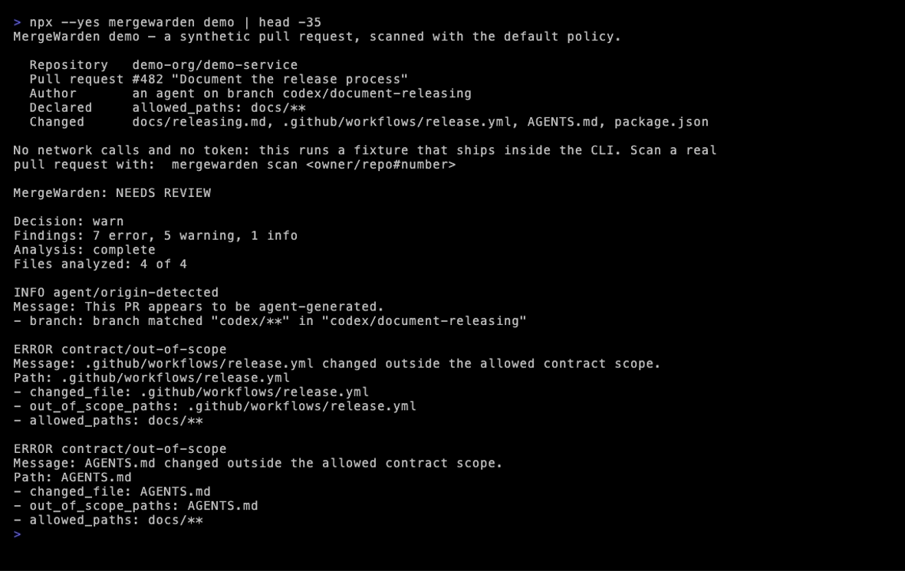

# MergeWarden：面向 AI PR 的变更管控门禁

[](https://github.com/sjh9714/mergewarden/releases)
[](https://github.com/sjh9714/mergewarden/actions/workflows/ci.yml)
[](https://github.com/sjh9714/mergewarden/actions/workflows/mergewarden.yml)
[](LICENSE)

> **守在 AI 智能体与主分支之间的那道门。**

[English](README.md) · 简体中文

编码智能体整天都在提 PR。MergeWarden 是一道变更管控门禁，用只有你的仓库才能定义的边界去检查每一个 PR：

- **这个 PR 有没有越出它自己声明的范围？** 智能体在 PR 正文的契约里声明打算改动的路径，超出范围的改动会被记为检查结果。
- **它有没有动到智能体控制平面？** 对 `AGENTS.md`、`CLAUDE.md`、`GEMINI.md`、`.mcp.json`、`.cursor/**` 这类文件的改动，会左右此后每一个智能体 PR 的行为，理应经过人眼确认。
- **它有没有把不可信文本接进智能体的提示词？** 从 PR 正文、标题或评论流向已登记的 agentic 工作流的新路径，会被追踪并标记出来。

它同时也会捕捉工作流权限提升、未按 SHA 固定的供应链引用，以及有风险的软件包生命周期脚本。

它**不会**执行 PR 中的代码，**不会**从 PR 的 head 读取策略，运行时**不会**调用大模型。每一个判定都附带可在本地复现的确定性证据。

MergeWarden 也用自己来把关自己的 PR —— 上面那枚 `MergeWarden` 徽章就是这个实时自检（[我们如何 dogfooding](docs/demo-prs.md#dogfooding-mergewarden-gates-its-own-prs)）。

## 60 秒试一下

不需要令牌、不需要仓库、不联网，先看看它能抓到什么：

```bash
npx --yes mergewarden@0.10.1 demo
```

这条命令会分析一个内置在 CLI 里的示例 PR，用的是**默认策略**——也就是说，它输出的 13 条检查结果，就是零配置安装时你实际会得到的东西。



_上图是真实的 `npx` 执行（用 `head` 截断以便完整显示开头），不是示意图。你可以直接复制那条命令自己跑一遍。_

然后扫描一个真实的 PR，用 `owner/repo#number` 或完整 URL 都可以：

```bash
npx --yes mergewarden@0.10.1 scan owner/repository#123
npx --yes mergewarden@0.10.1 scan https://github.com/owner/repository/pull/123
```

私有仓库或需要更高 API 速率限制时，用 `GH_TOKEN` 或 `GITHUB_TOKEN` 环境变量。MergeWarden 有意不提供传令牌的命令行参数。

默认输出比较精简；`--format json` 或 `--format markdown` 会给出完整的机器可读报告（见 [CLI 参考](docs/cli.md)）。

## 30 秒装好

新建 `.github/workflows/mergewarden.yml`：

```yaml
name: MergeWarden

on:
  pull_request:
    types: [opened, synchronize, reopened, edited, labeled, unlabeled, ready_for_review]

permissions:
  contents: read
  pull-requests: write

jobs:
  mergewarden:
    runs-on: ubuntu-latest
    steps:
      - uses: sjh9714/mergewarden@v0.10.1
        with:
          github-token: ${{ secrets.GITHUB_TOKEN }}
          mode: warn
          fail-on-block: false
          comment: auto
```

如果希望按 commit 固定成不可变引用，可以直接钉住 v0.10.1 的发布 commit：

```yaml
- uses: sjh9714/mergewarden@c32fb900b65708ea7c875b8ec4244c0983343970
```

不需要 checkout 步骤。MergeWarden 不发布、也不建议使用会漂移的 `v0` 标签。

首次运行不需要 `mergewarden.yml`：在 PR 的基线分支上确认到 404 之后，会选用内置的 warn 策略。认证失败、超出速率限制、服务端错误这几种情况绝不会静默回退。

## 你会看到什么

大多数智能体 PR 并不会越过任何边界。这类 PR 判为 `pass`，而 `comment: auto` 不会在
PR 下留言——findings 仍然完整记录在 Actions 的作业摘要里。只有出现 error、warning
或分析不完整时，才会留下一条评论：

```
ERROR contract/out-of-scope: src/billing/invoice.ts changed outside the allowed contract scope.
```

推一个修复上去，这条评论会就地更新为 `PASSED`，而不是被删除——过期的 “NEEDS REVIEW”
不会比它描述的问题活得更久。来自 fork 的 PR 从 GitHub 拿到的是只读令牌，因此不会被评论。

## 2,204 个真实智能体 PR 的扫描结果

我们用默认策略扫描了公开仓库上 2,204 个近期已合并的 AI 智能体 PR（Devin、Copilot coding agent、Codex、Claude Code、Cursor）：

- **2,204 个里有 0 个**以任何机器可校验的形式声明过自己的改动范围。
- 在 349 个改动了工作流或包清单的 PR 中，**12.9%** 提升了工作流权限，**17.5%** 引入了未固定版本的 action。
- **3.9%** 改动了智能体控制平面文件（`AGENTS.md`、`.mcp.json` 等）——也就是会影响此后每一个智能体 PR 的那些文件。
- 星标 10k+ 的仓库，检查结果发生率大约只有长尾仓库的**一半**。

所有数字都可以从公开查询复现：[研究方法](docs/study/methodology.md)。

需要说明的是，「0 / 2,204」衡量的是**采纳率而非需求**——从来没有项目要求贡献者声明改动范围，所以没人声明是意料之中。真正说明问题的是 3.9% 和 12.9%：这些改动的风险不依赖于任何缺失的声明，本身就是可见的。

## 它能捕捉什么

| 边界               | 确定性证据                                                                 |
| ------------------ | -------------------------------------------------------------------------- |
| PR 声明范围        | 落在 `allowed_paths` 之外或 `blocked_paths` 之内的文件                     |
| 智能体控制平面     | 对 `AGENTS.md`、`CLAUDE.md`、`GEMINI.md`、`.mcp.json`、`.cursor/**` 的改动 |
| Agentic 工作流注入 | 不可信的 GitHub 文本流入已登记的智能体提示词输入                           |
| 工作流特权         | 权限提升、新增 write-all 或 OIDC 访问                                      |
| 危险触发器         | `pull_request_target` 使用攻击者可控的 PR head 引用                        |
| 工作流供应链       | 未固定的 action、可复用工作流与容器镜像                                    |
| 包执行             | 新增或改动 install / prepare 类生命周期脚本                                |
| 测试证据           | 高风险源码改动却没有相应的测试文件改动                                     |
| 分析完整性         | 内容缺失、文件列表不完整、或触及报告上限                                   |

MergeWarden 评估的是**变更本身**，而不是把仓库里既有的工作流问题重复报一遍。每条检查结果都会给出规则、严重级别、路径、规范化证据，以及一个稳定的 finding ID。

## 也可以在 PR 出现之前就检查

同一套引擎还以 MCP server 的形式发布，面向的是运行智能体的人，而不是审查 PR 的维护者。
它只回答一个问题——这次改动有没有停留在被授予的范围内——并生成后续 gate 会读取的
contract 块。

```json
{ "mcpServers": { "mergewarden": { "command": "npx", "args": ["-y", "mergewarden-mcp"] } } }
```

不联网、不需要令牌、不调用模型（[详情](packages/mcp/README.md)）。

## 最小策略

已经有 AI 贡献政策（Apache / OpenSSF / Bitcoin Core 一脉）了吗？[`ai-contribution-policy.yml`](templates/ai-contribution-policy.yml) 预设可以一次复制粘贴就把其中可校验的条款落地执行——见[如何执行一份政策](docs/enforce-ai-contribution-policy.md)。

或者等你准备好调整行为时，把 `mergewarden.yml` 放到基线分支：

```yaml
version: 1
mode: warn

agent_detection:
  labels: [ai, agent, codex, claude]
  branch_patterns: ["codex/**", "claude/**", "ai/**"]

github_actions:
  checks:
    permission_escalation: error
    write_all: error
    pull_request_target_head: error
    unpinned_action: warn
    added_secret_reference: warn
    malformed_workflow: error

high_risk_paths:
  authentication:
    paths: ["src/auth/**"]
    require_tests: ["test/auth/**"]
    severity: error
```

智能体提交的 PR，可以在正文里声明自己打算改什么：

```md
<!-- mergewarden-contract
version: 1
agent: codex
task: update session expiry handling
allowed_paths:
  - src/auth/**
  - test/auth/**
-->
```

这份契约是**来自 PR 的不可信声明**，并不能证明任务或作者是正当的。基线分支上的策略始终具有权威性。

### 有时限的豁免

审阅过某条检查结果之后，维护者可以从可信的基线策略里豁免掉那一条确切的证据：

```yaml
waivers:
  - finding_id: agf_0123456789abcdef
    reason: Approved OIDC release workflow
    expires_at: "2026-09-30T00:00:00Z"
```

被豁免的检查结果仍然可见。豁免过期后原检查结果会重新生效，并额外产生 `policy/waiver-expired`。分析完整性类的检查结果不可被豁免。

完整说明见[配置参考](docs/configuration.md)。

## 稳妥地引入

1. 从 `mode: observe` 或 `mode: warn` 加 `fail-on-block: false` 开始。
2. 审阅检查结果，逐项调整严重级别。
3. 只在人工审阅之后，添加范围窄、会过期的豁免。
4. 策略稳定后切到 `mode: block`。
5. 设置 `fail-on-block: true`，并在分支保护里把这个检查设为必需。

面向人的报告状态刻意做了区分：

- `PASSED`：分析完成，没有活跃的 warning / error 检查结果。
- `OBSERVED FINDINGS`：observe 模式发现了证据，但不改变通过判定。
- `NEEDS REVIEW`：warn 模式，需要人来做决定。
- `BLOCKED`：block 模式拒绝了活跃的策略检查结果。
- `ANALYSIS INCOMPLETE`：MergeWarden 无法给出可信判定，采取保守失败（fail closed）。

## 信任边界

这个 GitHub Action：

- 只通过 GitHub API 读取 PR 元数据与文件内容
- 从确切的基线 commit 加载配置
- 绝不检出、也绝不执行由 PR 控制的代码
- 绝不对工作流 YAML 里的 GitHub 表达式求值
- 分析过程中绝不调用大模型
- 限制 API 并发、单文件单侧 1 MiB / 单次运行 64 MiB 的内容上限，以及检查结果数量和报告体积
- 记录 base/head SHA、策略摘要、已分析文件数和引擎版本

GitHub 的 PR 文件 API 上限是 3,000 个文件。MergeWarden 会把权威的 PR 文件数与实际收集到的列表做对比，宁可保守失败，也不会拿一份不完整的结果给出「通过」。

完整内容见[安全模型](docs/security-model.md)与[证据模型](docs/evidence-model.md)。

## MergeWarden 不是工作流 linter

zizmor 这类工作流 linter 检查的是工作流本身的正确性和已知的错误配置；大模型 reviewer 提供的是语义判断。MergeWarden 是 AI 生成的 PR 与合并之间的那一层变更管控：它问的是这个 PR 有没有越过仓库特有的边界，并把理由记录下来。

三者解决的是不同问题，该用哪个用哪个。

## Action 输出

| 输出                                           | 含义                                           |
| ---------------------------------------------- | ---------------------------------------------- |
| `decision`                                     | `pass`、`warn` 或 `block`                      |
| `status`                                       | 面向人/机的状态，包含 `incomplete`             |
| `analysis-complete`                            | 所需证据是否全部可用                           |
| `error-count` / `warning-count` / `info-count` | 活跃检查结果数量                               |
| `waived-count`                                 | 保留但不计入判定的检查结果                     |
| `expected-file-count` / `analyzed-file-count`  | 文件列表完整性证据                             |
| `report-json` / `report-markdown`              | 生成的报告路径                                 |
| `risk-score`                                   | 已废弃的 v0.x 兼容输出，并非经过校准的风险度量 |

输入参数与失败行为见 [Action 参考](docs/action-reference.md)。

## 参与开发

```bash
pnpm install
pnpm test
pnpm typecheck
pnpm lint
pnpm build
pnpm format:check
```

每条规则都必须配有通过与不通过的 fixture、精确的规则/严重级别/判定断言，面向用户的检查结果还需要 Markdown 快照。

欢迎从 [good first issue](https://github.com/sjh9714/mergewarden/labels/good%20first%20issue) 开始——每个都写明了要改哪个文件、用什么命令验证、以及完成标准。也可以先看[贡献指南](CONTRIBUTING.md)。

用中文提 issue 完全没问题——维护者会借助翻译阅读和回复，不必勉强用英文。

## 文档

- [文档索引](docs/README.md) —— 全部指南与参考
- [快速上手](docs/getting-started.md) · [配置](docs/configuration.md) · [安全模型](docs/security-model.md)

如果 MergeWarden 报出了一条你们团队认为完全没问题的边界跨越，那是这个项目能收到的最有价值的 bug 报告——请带上 `npx mergewarden scan` 的输出开一个 issue。

## 许可证

[MIT](LICENSE)
